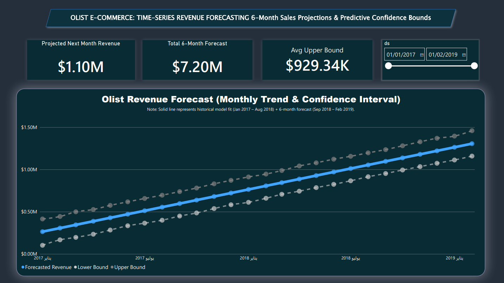

# Brazilian E-Commerce (Olist) — SQL & Geo-Spatial Analysis

---

## 📊 Dashboards & Visualizations

* **Geographic Sales & Shipping Analysis (Power BI):** Detailed performance report available in [Geo_Dashboard_Overview & Shipping.pdf](./Geo_Dashboard_Overview%20&%20Shipping.pdf).
* **Revenue Forecasting Model (Python & Prophet):** Interactive overview of 6-month projected revenue trends.

### 📈 Time-Series Forecasting Dashboard

## Overview
A SQL analysis of the Olist Brazilian e-commerce public dataset, focused on order fulfillment, delivery performance, payments, and product category revenue. The project emphasizes multi-table joins, correlated subqueries, and window functions on real transactional data — a deliberate step up in scope and dataset complexity from an earlier HR-focused SQL project. The analysis was later extended into a geo-spatial phase: real-world distance calculation (Haversine formula), a two-page interactive Power BI dashboard, and a test of whether shipping distance actually affects delivery delay.

## Data Source
The Olist Brazilian E-Commerce Public Dataset (Kaggle), covering ~99,441 orders. Eight of the nine available tables were used:

| Table | Rows | Description |
|---|---|---|
| `olist_orders_dataset` | 99,441 | Core order record: status, purchase/approval/delivery timestamps |
| `olist_customers_dataset` | 99,441 | Customer records |
| `olist_order_items_dataset` | 112,650 | Line items per order (products, price, freight) |
| `olist_order_payments_dataset` | 103,886 | Payment method and value per order |
| `olist_order_reviews_dataset` | 99,224 | Customer reviews |
| `olist_products_dataset` | 32,951 | Product catalog |
| `olist_sellers_dataset` | 3,095 | Seller records |
| `product_category_name_translation` | 71 | Portuguese-to-English category name mapping |

**Initially excluded, later revisited:** `olist_geolocation_dataset` (~1,000,163 rows of zip-code coordinates) was left out of the initial SQL phase, since meaningful use of geographic data requires distance calculations and map-based visualization beyond standard SQL analysis. It was brought back in for the Geo-Spatial Extension described below.

## Tools
- **DB Browser for SQLite** — database creation, CSV import, query execution
- **SQL** — data validation, joins, correlated subqueries, window functions, date functions, the Haversine formula
- **Power BI Desktop** — connected to the SQLite database via an ODBC driver, DAX measures, interactive map visuals

## Methodology
1. **Data Validation** — checked for duplicate keys and referential integrity between every related table pair (orders/customers, order_items/products), and audited missing values across all order lifecycle date columns.
2. **Delivery Time Analysis** — measured actual vs. estimated delivery using `julianday()`, cross-checked the average against a manually computed median to test for outlier influence, and investigated an anomalous date cluster.
3. **Payment Analysis** — profiled transaction volume and average value by payment method.
4. **Multi-Table Joins** — joined three tables (order items → products → category translation) to analyze revenue by product category.
5. **Correlated Subqueries** — identified items priced above their own category's average, with the subquery re-evaluated per row rather than computed once.
6. **Window Functions** — ranked products by price within each category using `RANK() OVER (PARTITION BY ...)`, wrapped in a derived table.

## Key Insights
- **Dataset design:** `olist_customers_dataset` is a transactional view, not a full user base — every customer row corresponds to exactly one order (99,441 = 99,441, confirmed by query). The same logic explains why every cataloged product has been sold at least once.
- **Delivery performance:** orders are delivered 11.18 days early on average (median: 11.9 days), indicating Olist uses conservative delivery estimates. This holds despite rare extreme outliers (up to 189 days late, and one order 146 days early) — the close average/median agreement confirms these are isolated cases, not a skewed pattern.
- **Data anomaly — status/date mismatch:** 8 orders are marked `delivered` but have no delivery date recorded, a genuine inconsistency between the status and timestamp fields.
- **Data anomaly — delay clustering:** 21 orders delivered on 2017-09-19 alone show delays over 100 days, despite that date not being a generally high-volume delivery day — suggesting a possible batch status update or systemic logging event rather than independent delays. The exact cause could not be confirmed from the dataset alone.
- **Payments:** credit card dominates (~74% of transactions, highest average value at $163.32), followed by boleto (a common Brazilian bank-slip payment method).
- **Revenue by category:** `health_beauty` leads in total revenue, but `watches_gifts` reaches a close second with far fewer items sold — its average price per item ($201.14) is about 54% higher than `health_beauty`'s ($130.16), reflecting a higher-price/lower-volume model.
- **Data validation catch found mid-analysis:** while ranking products by category, 610 of 32,951 products (~1.85%) surfaced with a NULL category — a gap missed in the initial validation pass and caught only once it appeared in later query results. Documented and excluded explicitly rather than left unlabeled.

## Geo-Spatial Extension (SQL + Power BI)
The analysis was extended using `olist_geolocation_dataset`, previously excluded, to answer a deeper question: does shipping distance actually affect delivery delay?

**Data preparation (SQL):**
- Reduced the 1,000,163-row geolocation table to 19,015 rows (one averaged lat/lng per zip code prefix) — a 98% size reduction with no loss of city/region-level precision.
- Joined customer and seller coordinates per order (the same lookup table joined twice under different aliases, applying the self-join principle from the HR project across two different tables).
- Implemented the Haversine formula manually in SQL (SIN, COS, ATAN2 — no built-in distance function in SQLite) to calculate real customer-to-seller distance in kilometers.
- Added an `IsDelayed` flag, freight cost, and a `ShippingRoute` (state-to-state) column to support further analysis beyond the average delay figure alone.

**Key finding — distance vs. delay:** grouping orders into near (<100km), medium (100-500km), and far (>500km) bands showed all three groups delivering ahead of schedule, with the early-delivery margin *growing* with distance (-8.9 / -11.6 / -12.2 days respectively). This does not mean longer shipments arrive faster — it indicates Olist applies a more conservative delivery estimate for longer distances, protecting the promised date rather than distance improving actual performance.

**On-time rate matters more than the average:** while the average order arrives ~11 days early, only **7.9%** of orders are actually delayed — the average alone would have hidden this more useful on-time rate.

**Dashboard (Power BI):** a two-page interactive dashboard, connected live to the SQLite database via ODBC.
- *Geographic Overview* — KPI cards (on-time rate, avg distance, avg freight), a map of customer locations, and a delay-colored map (Delayed / Early / On-Time categories)
- *Shipping Cost & Distance Analysis* — a freight-cost-vs-distance scatter plot (colored by delay category) and a Top 10 Shipping Routes chart by order volume (SP → SP dominates, consistent with São Paulo's outsized role in Brazilian commerce)

See `Geo_Dashboard_Overview.pdf` and `Geo_Dashboard_Shipping.pdf` for static exports of both pages.

## Files
- `Olist_SQL_Queries.sql` — full annotated query log for the core analysis, in chronological order.
- `Geo_Sales_Delivery_Queries.sql` — annotated query log for the geo-spatial extension (Haversine distance, KPI table, IsDelayed/DelayCategory).

## Author
Fathallah Saied Abou Eid
